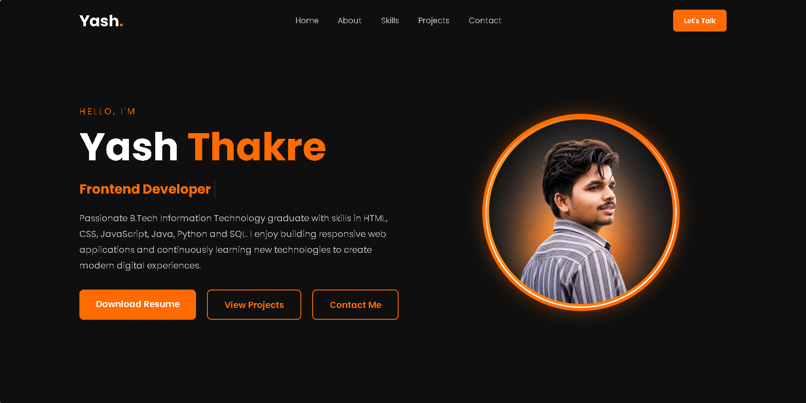
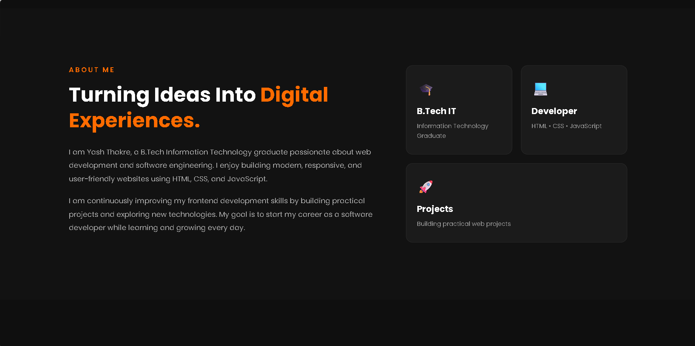
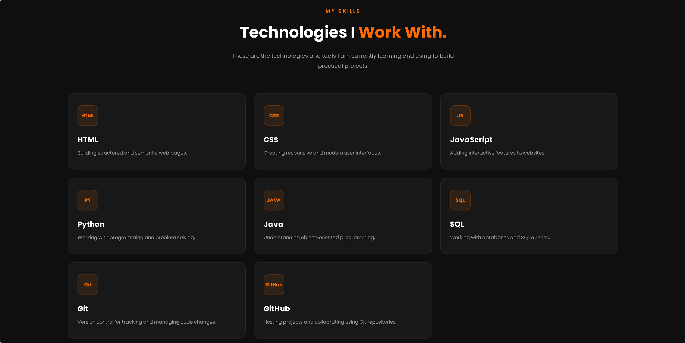
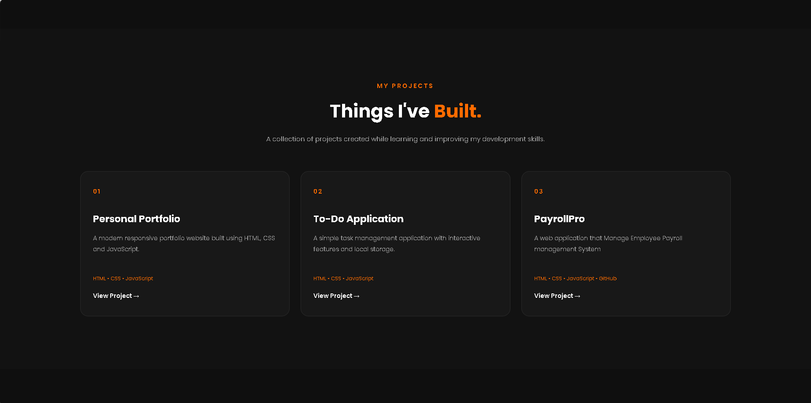

👋 Yash Thakre — Personal Portfolio

Welcome to my personal portfolio website! 🚀

I'm Yash Thakre, a B.Tech Information Technology graduate with an interest in technology, software development, and practical IT solutions.

This portfolio showcases my skills, projects, and professional journey.

## 📸 Portfolio Preview

### 🏠 Profile

### 👨‍💻 About Me

### 🛠️ Skills

### 🚀 Projects

🛠️ Technologies Used

- HTML5
- CSS3
- JavaScript
- Responsive Web Design
- Git & GitHub

✨ Features

- 👨‍💻 Personal introduction
- 🛠️ Skills and technologies
- 📂 Project showcase
- 📄 Resume section
- 📱 Responsive design
- 🎨 Modern and clean UI
- 🔗 Social/contact links

📸 Portfolio Preview

«Add screenshots of your portfolio website here.»

📂 Project Structure

yash-portfolio/
│

├── index.html

├── css/

├── js/

├── assets/

├── profile.png

├── resume.pdf.pdf

└── README.md

🚀 Getting Started

To run this portfolio locally:

git clone https://github.com/yashthakre05/yash-portfolio.git
cd yash-portfolio

Then open "index.html" in your browser.

📌 Project Status

Completed ✅

This portfolio will be updated as I build new projects and gain new skills.

📬 Connect With Me

- 💼 LinkedIn: "Yash Thakre" (https://www.linkedin.com/)
- 🐙 GitHub: "yashthakre05" (https://github.com/yashthakre05)

---

⭐ If you like my portfolio, feel free to explore my other projects!
